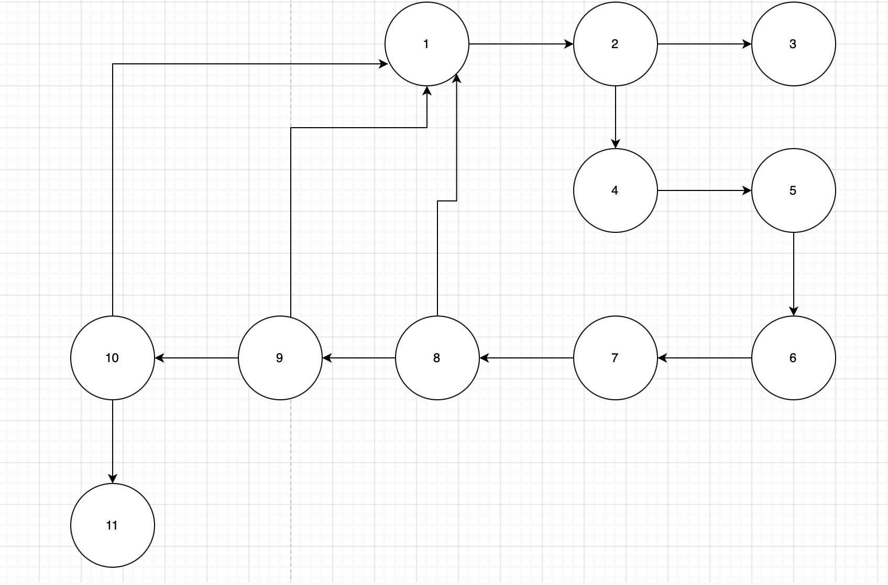

# Implementação do Algoritmo de Karatsuba

## Descrição do Projeto
Este projeto implementa o algoritmo de Karatsuba em Python para multiplicação eficiente de dois números inteiros grandes. O algoritmo reduz a complexidade da multiplicação tradicional de O(n²) para aproximadamente O(n^1.58), tornando-o mais eficiente para números grandes.

### Explicação do Algoritmo
1. Se os números forem pequenos (menores que 10), multiplica diretamente.
2. Divide os números em partes superiores e inferiores.
3. Calcula três produtos recursivamente:
   - `p1 = low_x * low_y`
   - `p3 = (low_x + high_x) * (low_y + high_y)`
   - `p2 = high_x * high_y`
4. Combina os resultados para obter o produto final.

### Explicação do Código
O código está implementado no arquivo `main.py` e segue a estrutura:

```python
def karatsuba(x: int, y: int) -> int:
    """
    Implementação do algoritmo de Karatsuba para multiplicação eficiente de inteiros.
    """
    if x < 10 or y < 10:
        return x * y
    
    # Determina o tamanho dos números
    n = max(len(str(x)), len(str(y)))
    m = n // 2
    
    # Divide os números em duas partes
    high_x, low_x = divmod(x, 10**m)
    high_y, low_y = divmod(y, 10**m)
    
    # Calcula os três produtos necessários
    p1 = karatsuba(low_x, low_y)
    p3 = karatsuba((low_x + high_x), (low_y + high_y))
    p2 = karatsuba(high_x, high_y)
   

```

### Passo a Passo do Código
1. **Caso base**: Se um dos números for menor que 10, retorna a multiplicação direta.
2. **Determina o tamanho dos números**: Calcula `n`, o número de dígitos do maior número, e `m`, a metade de `n`.
3. **Divide os números**: Usa `divmod` para separar os números em `high_x, low_x` e `high_y, low_y`.
4. **Executa recursões**:
   - `p1` calcula a multiplicação das partes inferiores.
   - `p3` calcula a multiplicação da soma das partes inferiores e superiores.
   - `p2` calcula a multiplicação das partes superiores.
5. **Combina os resultados**: Faz a recomposição dos produtos intermediários para obter o resultado final.

## Como Executar o Projeto

### Requisitos
- Python 3.x instalado

### Passos para execução
1. Clone este repositório:
   
   git clone <URL_DO_REPOSITORIO>
   
2. Acesse a pasta do projeto:
   
   cd <NOME_DA_PASTA>
   
3. Execute o código:
   
   python main.py
   

### Estrutura do Projeto
A estrutura dos arquivos do projeto é a seguinte:
```
<FPA_T1>/
│── README.md  # Documentação do projeto
│── Grafo.png
│── src/
│   └── main.py  # Implementação do algoritmo de Karatsuba
```

## Relarório Técnico

### Complexidade Ciclomática
A complexidade ciclomática mede a quantidade de caminhos independentes no código. O grafo de fluxo de controle inclui:
- Nós representando chamadas recursivas e operações matemáticas.
- Arestas ligando os nós conforme o fluxo do algoritmo.



- (Nó 1) = def karatsuba(x: int, y: int) -> int:
- (Nó 2) = if min(x, y) < 10:
- (Nó 3) = return x * y
- (Nó 4) = n = max(len(str(x)), len(str(y)))
- (Nó 5) = m = n // 2  
- (Nó 6) = high_x, low_x = divmod(x, 10**m)
- (Nó 7) = high_y, low_y = divmod(y, 10**m)
- (Nó 8) = p1 = karatsuba(low_x, low_y)
- (Nó 9) = p2 = karatsuba(high_x, high_y)
- (Nó 10) = p3 = karatsuba(low_x + high_x, low_y + high_y)
- (Nó 11) = return (p2 * 10**(2 * m)) + ((p3 - p2 - p1) * 10**m) + p1

A fórmula utilizada é:
\[ M = E - N + 2P \]
Onde:
- `E`: Número de arestas do grafo. 
- `N`: Número de nós.
- `P`: Número de componentes conexos (1 para um único programa).

\[ M = 13 - 11 + 2(1) \]

O cálculo para este algoritmo resultou em uma complexidade ciclomática de **4**, indicando um fluxo de controle simples e bem estruturado.

### Complexidade Assintótica
A complexidade do algoritmo é:
- **Melhor caso**: O(1)
- **Caso médio**: O(n^1.58)
- **Pior caso**: O(n^1.58)

Essa complexidade é derivada da relação de recorrência:
\[ T(n) = 3T(n/2) + O(n) \]
Que, ao resolver pelo método mestre, resulta em O(n^log2(3)), aproximadamente O(n^1.58).

## Conclusão
O algoritmo de Karatsuba é uma alternativa eficiente à multiplicação tradicional, especialmente para números grandes. Sua complexidade reduzida o torna uma escolha viável em aplicações que exigem operações matemáticas intensivas. Embora tenha um overhead inicial devido à recursão, seu desempenho melhora significativamente à medida que os números aumentam. Assim, ele é amplamente utilizado em computação científica, criptografia e outros domínios que exigem manipulação de grandes números inteiros.
